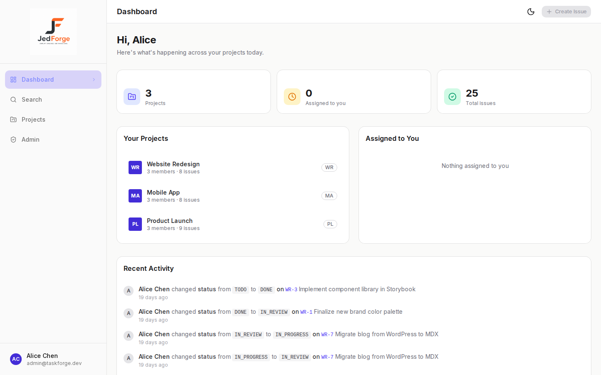
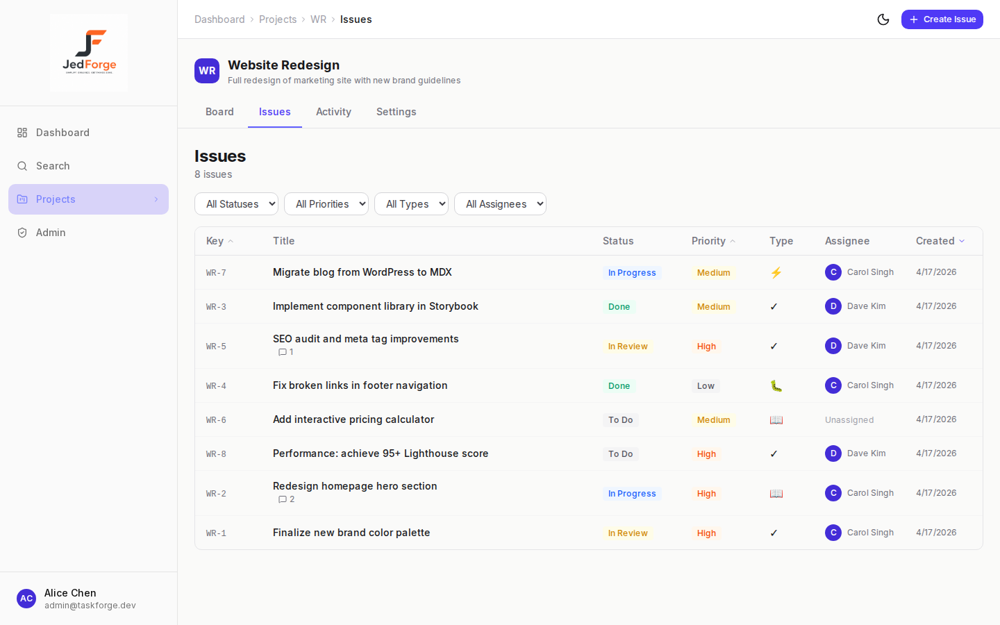
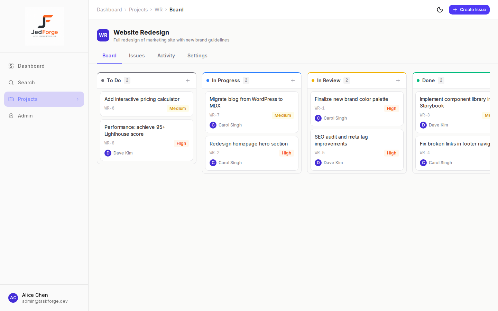
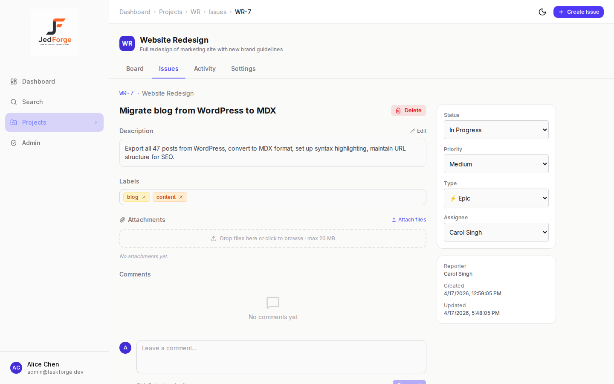
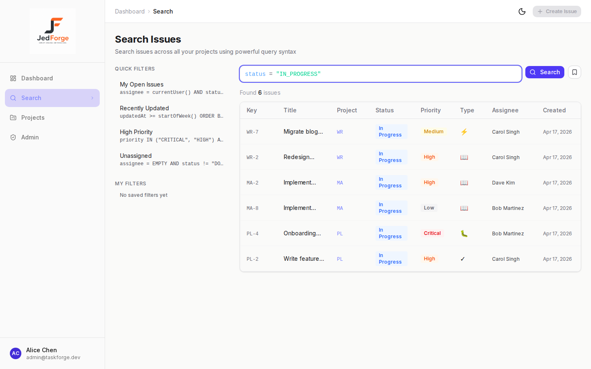

# JedForge

A full-stack project management tool built as a portfolio project to demonstrate modern full-stack development skills.

**Live demo:** [www.ciphercompass.com](https://www.ciphercompass.com)

---

## Features

- **Authentication** — Secure sign up / sign in with email and password (NextAuth.js v5)
- **Project Management** — Create and manage multiple projects with unique keys (e.g. JF-1)
- **Issue Tracking** — Full CRUD for issues with status, priority, type, assignee, and labels
- **Kanban Board** — Drag-and-drop board with optimistic UI updates, cross-column moves, and within-column reordering
- **Custom Query Language** — Structured search with field filters, logical operators, `ORDER BY`, and `currentUser()` references
- **Saved Filters** — Personal and admin-promoted global saved queries
- **Issue Detail** — Inline editing for all fields, rich description, assignee management
- **Comments** — Add, edit, and delete comments on issues with author-only permissions
- **Activity Feed** — Full audit trail of changes, per-issue and project-wide activity views
- **Filtering & Sorting** — Filter issues by status, priority, type, assignee, and search term
- **Role-Based Access Control** — OWNER / ADMIN / MEMBER / VIEWER roles per project
- **Multi-tenant** — Each organization sees only its own projects and members
- **Responsive Design** — Mobile-first layout with collapsible sidebar navigation
- **Loading States** — Skeleton screens for all data-fetching pages
- **Toast Notifications** — Real-time feedback for all user actions
- **Error Handling** — Friendly error pages for 404, 403, and unexpected errors

---

## Tech Stack

| Layer | Technology |
|-------|-----------|
| Framework | Next.js 14 (App Router) |
| Language | TypeScript (strict mode) |
| Database | PostgreSQL + Prisma ORM |
| Auth | NextAuth.js v5 (JWT) |
| Styling | Tailwind CSS v4 + shadcn/ui |
| Drag & Drop | @dnd-kit/core + @dnd-kit/sortable |
| Notifications | Sonner |
| Date Formatting | date-fns |
| CI | GitHub Actions (lint → build → test) |

---

## Screenshots

Screenshots are stored in [`docs/screenshots/`](docs/screenshots/).

| View | Screenshot |
|------|-----------|
| Dashboard |  |
| Project Issue List |  |
| Kanban Board |  |
| Issue Detail |  |
| Query / Search |  |

---

## Architecture

### Next.js App Router

The app uses Next.js 14's App Router with route groups to separate authenticated pages from the public sign-in flow:

```
app/
├── (auth)/          # sign-in page — no layout wrapper
└── (dashboard)/     # authenticated layout with sidebar
    ├── page.tsx     # dashboard home — lists all projects
    └── projects/
        └── [projectKey]/
            ├── issues/      # list view
            ├── board/       # Kanban view
            └── settings/    # project admin
```

Server Actions (`"use server"`) handle all mutations — no separate API layer is needed for the dashboard. The only API routes are for NextAuth's credential provider (`/api/auth/...`).

### Prisma / PostgreSQL Data Model

Key relationships:

```
Organization ──< Project ──< Issue ──< Comment
     │               │
     └──< OrgMember  └──< ProjectMember
```

- Every `Project` belongs to exactly one `Organization`.
- `ProjectMember` rows scope which users can access which projects (tenancy boundary).
- `Issue.position` (integer) drives ordering on the Kanban board; `Issue.status` maps to board columns.
- `SavedFilter` rows store serialised query strings; `isGlobal = true` makes a filter visible to all org members.

### NextAuth Credentials Auth

Authentication uses the Credentials provider with bcrypt password hashing. Sessions are JWT-based (no database session table). The `session.user.id` and `session.user.role` values are embedded in the JWT at sign-in and read on every request.

### Project Membership / RBAC

Each user has a system-level `role` (ADMIN or MEMBER) and a per-project `ProjectMemberRole` (OWNER, ADMIN, MEMBER, or VIEWER). Project-level role is checked on every server action via `requireProjectRole(projectKey, permissionCheck)`:

| Action | Minimum role |
|--------|-------------|
| View issues / board | VIEWER |
| Create / edit / delete issues | MEMBER |
| Manage project members | ADMIN |
| Rename / delete project | OWNER |

### Custom Query Parser / Search

`src/lib/query/` implements a hand-written recursive-descent parser for a structured query language:

```
status = "IN_PROGRESS" AND assignee = currentUser() ORDER BY createdAt DESC
```

The parser produces an AST that `executor.ts` translates into a Prisma `where` clause. The executor always ANDs a `projectId: { in: memberProjectIds }` security filter onto every query, preventing cross-tenant data leakage regardless of the query string.

### GitHub Actions CI

`.github/workflows/ci.yml` runs on every push and pull request:

1. `npm run lint` — ESLint via Next.js config
2. `npm run build` — full production build (catches type errors)
3. `npm test` — Vitest unit and integration tests

---

## Getting Started

### Prerequisites

- Node.js 18+
- PostgreSQL 14+

### Installation

1. **Clone the repository**
   ```bash
   git clone <repo-url>
   cd taskforge
   ```

2. **Install dependencies**
   ```bash
   npm install
   ```

3. **Set up environment variables**
   ```bash
   cp .env.example .env
   ```
   Edit `.env` with your database connection string and auth secrets.

4. **Set up the database**
   ```bash
   npx prisma migrate dev --name init
   ```

5. **Seed with demo data**
   ```bash
   npm run db:seed
   ```

6. **Start the development server**
   ```bash
   npm run dev
   ```

Open [http://localhost:3000](http://localhost:3000) in your browser.

### Demo Accounts

After seeding, you can log in with:

| Email | Password | Role |
|-------|----------|------|
| admin@jedforge.dev | password123 | Admin |
| member@jedforge.dev | password123 | Member |
| carol@jedforge.dev | password123 | Member |
| dave@jedforge.dev | password123 | Member |

---

## Deployment (Railway)

JedForge is deployed on [Railway](https://railway.app). The `railway.toml` at the root configures the build and start commands.

### Required environment variables

| Variable | Description |
|----------|-------------|
| `DATABASE_URL` | PostgreSQL connection string (from Railway's Postgres service) |
| `NEXTAUTH_URL` | Full public URL of the deployment (e.g. `https://www.ciphercompass.com`) |
| `NEXTAUTH_SECRET` | Random secret — generate with `openssl rand -base64 32` |
| `AUTH_SECRET` | Same value as `NEXTAUTH_SECRET` (required by NextAuth v5) |

### Optional — file attachments (Railway Object Storage)

| Variable | Description |
|----------|-------------|
| `RAILWAY_BUCKET_ENDPOINT` | Storage endpoint URL |
| `RAILWAY_BUCKET_ACCESS_KEY_ID` | Bucket access key |
| `RAILWAY_BUCKET_SECRET_ACCESS_KEY` | Bucket secret key |
| `RAILWAY_BUCKET_NAME` | Bucket name |
| `RAILWAY_BUCKET_REGION` | Region (typically `auto`) |

### First deploy steps

1. Create a Railway project and add a **PostgreSQL** service.
2. Add a **Web** service pointed at this repo. Railway auto-detects Next.js.
3. Set the environment variables above in the Railway dashboard.
4. After the first deploy, run migrations:
   ```bash
   railway run npx prisma migrate deploy
   ```
5. Optionally seed demo data:
   ```bash
   railway run npm run db:seed
   ```

---

## Project Structure

```
src/
├── app/                    # Next.js App Router pages
│   ├── (dashboard)/        # Authenticated layout group
│   │   ├── page.tsx        # Dashboard home
│   │   ├── projects/       # Project pages (issues, board, settings)
│   │   ├── search/         # Global query search + saved filters
│   │   └── admin/          # Admin panel (org/user management)
│   └── api/                # API routes (NextAuth)
├── components/
│   ├── board/              # Kanban board + drag-and-drop
│   ├── comments/           # Comment thread & form
│   ├── activity/           # Activity feed
│   ├── issues/             # Issue list, detail, form
│   ├── query/              # Query bar + saved filter UI
│   ├── layout/             # Sidebar, header, nav
│   └── ui/                 # Reusable shadcn/ui primitives
├── lib/
│   ├── query/              # Recursive-descent parser + executor
│   │   ├── parser.ts
│   │   └── executor.ts
│   ├── permissions.ts      # Role-based permission helpers
│   ├── issue-keys.ts       # Issue key generation with retry
│   ├── auth.ts             # NextAuth config
│   └── prisma.ts           # Prisma client singleton
└── prisma/
    ├── schema.prisma       # Database schema
    └── seed.ts             # Demo data
```

---

## Built With

This project was built with the assistance of **[Claude Code](https://claude.ai/claude-code)** by Anthropic — an AI-powered CLI for software development.

---

Built by [Your Name] · [Portfolio Link] · [LinkedIn]
